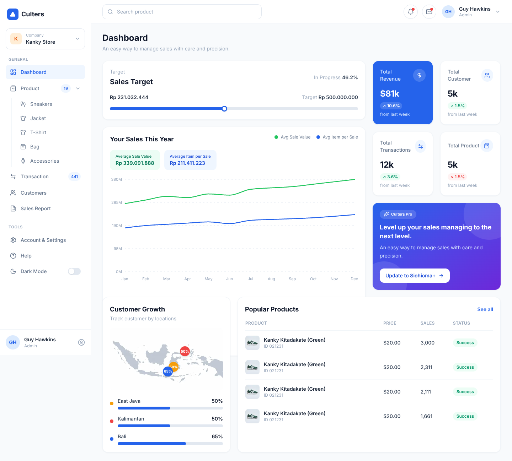
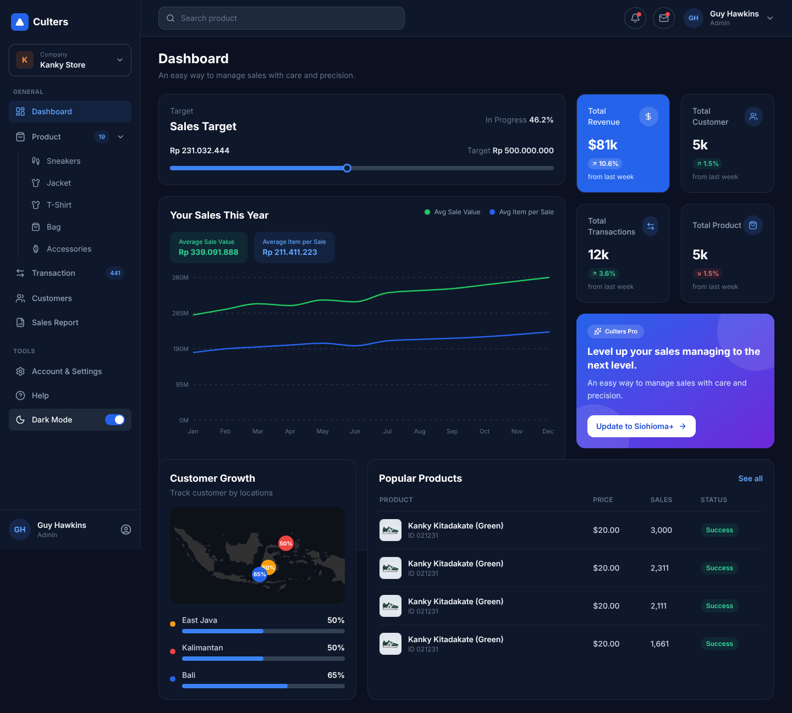

# Culters — Sales E-Commerce Dashboard

Implementation of the **Sales E-commerce Dashboard UI Kit** (Figma Community) main page, built with **Next.js 14 (App Router)** and **Tailwind CSS**.



## ✨ Features

- **Live API data** — every section (sales target, stat cards, sales chart, customer growth, popular products) is fed by the dashboard API.
- **Loading skeleton** — a full-page skeleton mirrors the final layout while data is being fetched.
- **Error handling** — a friendly error state with a **Try again** button is shown if the request fails.
- **Charts** — yearly sales line chart built with [Recharts](https://recharts.org), with a custom tooltip and legend driven by the API `series` config.
- **Dynamic progress bars** — sales target progress (with slider thumb, as in the design) and per-province customer growth bars.
- **Fully responsive** — collapsible sidebar with overlay on mobile, stacked card layout on small screens, 3-column grid on desktop.
- **Dark mode** 🌙 — the sidebar "Dark Mode" toggle (as in the Figma kit) switches the whole dashboard. The choice is persisted in `localStorage`, respects `prefers-color-scheme` on first visit, and a tiny inline script applies it before first paint (no flash). Chart grid/axis/tooltip colors are theme-aware too.

| Light | Dark |
| ----- | ---- |
|  |  |

## 🏗️ Architecture

```
src/
├── app/
│   ├── api/dashboard/route.ts   # Server-side proxy for the upstream API (solves CORS)
│   ├── layout.tsx               # Root layout + Inter font
│   └── page.tsx                 # Dashboard page (sidebar + header + content)
├── components/
│   ├── layout/                  # Sidebar, Header
│   ├── dashboard/               # One component per dashboard section
│   │   ├── DashboardView.tsx    # Orchestrates data fetching + layout grid
│   │   ├── SalesTargetCard.tsx
│   │   ├── StatCard.tsx
│   │   ├── SalesChartCard.tsx
│   │   ├── CustomerGrowthCard.tsx
│   │   ├── PopularProductsCard.tsx
│   │   ├── PromoCard.tsx
│   │   ├── DashboardSkeleton.tsx
│   │   └── ErrorState.tsx
│   └── ui/                      # Reusable primitives (Card, ProgressBar, Skeleton)
├── hooks/
│   ├── useDashboard.ts          # Fetch + loading/error state + refetch (abort-safe)
│   └── useTheme.tsx             # Theme context: dark-mode toggle + localStorage persistence
└── lib/
    ├── types.ts                 # Typed API contract
    ├── format.ts                # Currency / number formatters
    └── cn.ts                    # className combiner
```

### Why an API proxy route?

The upstream WireMock API (`https://wgm5g.wiremockapi.cloud/dashboard`) does not send
CORS headers, so the browser can't call it directly. The Next.js Route Handler at
`/api/dashboard` fetches it server-side (with a 30s revalidation window) and exposes
it to the client — keeping the upstream URL out of the client bundle as a bonus.

## 🚀 Getting started

```bash
npm install
npm run dev      # http://localhost:3000
```

Production build:

```bash
npm run build
npm start
```

## 🛠️ Tech stack

| Tool          | Purpose                  |
| ------------- | ------------------------ |
| Next.js 14    | App Router, API proxy    |
| Tailwind CSS  | Styling                  |
| Recharts      | Sales line chart         |
| lucide-react  | Icons                    |
| TypeScript    | Typed API contract       |

## 📝 Notes

- The map section is a static image (per challenge instructions — interactivity not required); growth pins are overlaid on top of it.
- The promo banner, sidebar navigation, and header are static UI from the design; all data-driven sections come from the API.
